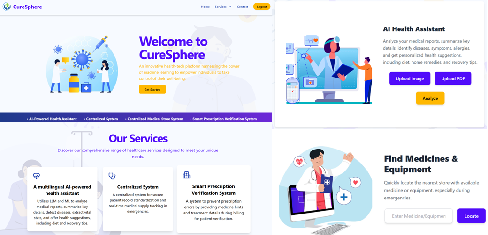
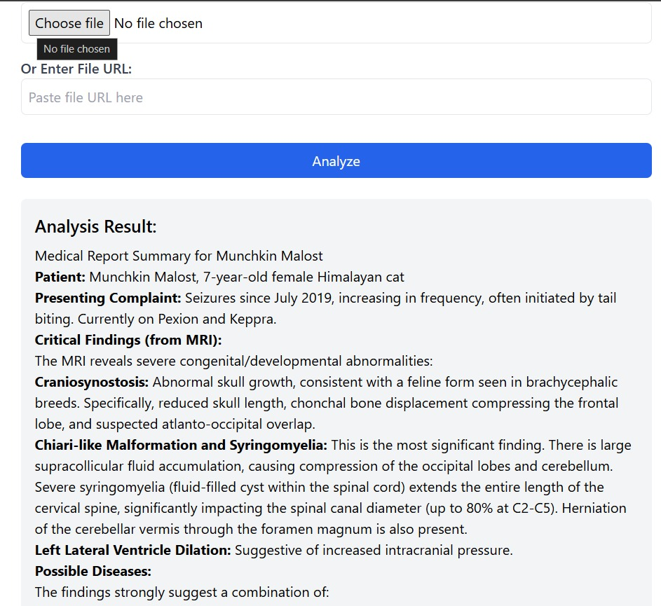

# 🚀 CureSphere - Multilingual AI-Powered Health Assistant

  

### 🌍 Transforming Healthcare with AI & ML

**CureSphere** is an intelligent, multilingual health assistant designed to revolutionize medical report analysis and patient care. By leveraging **LLM & ML models**, it provides comprehensive insights into medical reports, ensuring quick and accurate understanding for both patients and doctors.

---
## 🏥 Key Features
### 🏥 AI-Powered Medical Report Analysis
- 📄 **Upload medical reports (PDF/Image)** and get instant analysis.
- 🏷️ **Summarizes key details**, identifying diseases, symptoms, allergies, and extracting vital stats like BP & glucose levels.
- 💡 **Health suggestions** including diet, home remedies, and recovery tips.
- 🌎 Supports **multiple languages** for better accessibility.

### 🔗 Centralized Healthcare Data Exchange
- A **secure and standardized system** for managing patient records across hospitals.
- Ensures seamless **access to critical information** during emergencies.
- Especially beneficial for **orphans or patients with incomplete medical history**.

### 🏪 Smart Medical Store System
- 📍 **Locate medicines & medical equipment** in the nearest store during emergencies.
- 🏥 **Real-time availability tracking** for essential medical supplies like Medical Equiments or Medicines.

### 🔍 Smart Prescription Verification
- Prevents **misinterpretation of handwritten prescriptions**.
- Provides **medication hints** when store staff enter medicine names during billing.
- Patients can **verify prescriptions** with their doctor’s instructions.

---
## 🎬 Demo

🌟 **Watch CureSphere in Action**: []()

📑 **View the Complete Presentation**: [](https://drive.google.com/file/d/11OvK39v4rGCmlPR5zuCJLK6DLrcHqTXT/view?usp=drive_link)

---
## 🚀 Tech Stack

- **Frontend:** HTML, Tailwind CSS, JavaScript
- **Backend:** Flask, Python
- **AI/ML:** Large Language Models (LLM), Machine Learning, NLP
- **Database:** MongoDB
- **Cloud & Deployment:** Render / AWS / Vercel

---
## 📸 Screenshot

| Medical Report Analysis |
|----------------------|
|  |


---
## 📦 Setup & Installation

1️⃣ **Clone the Repository**
```bash
  git clone https://github.com/YOUR_GITHUB_USERNAME/CureSphere.git
  cd CureSphere
```
2️⃣ **Install Dependencies**
```bash
  pip install -r requirements.txt
```
3️⃣ **Run the Application**
```bash
  python app.py
```
4️⃣ **Open in Browser**
```
  http://127.0.0.1:5000/
```

---
## 🤝 Contributing
We welcome contributions! Feel free to **open issues**, **submit PRs**, or share ideas. 🚀

---
## 📬 Contact
📧 **Email:** mayank.091827@gmail.com 
🔗 **LinkedIn:** [Your LinkedIn](https://www.linkedin.com/in/mayank0510/)  
---

🚀 *CureSphere - Empowering Healthcare with AI!* 🚀
